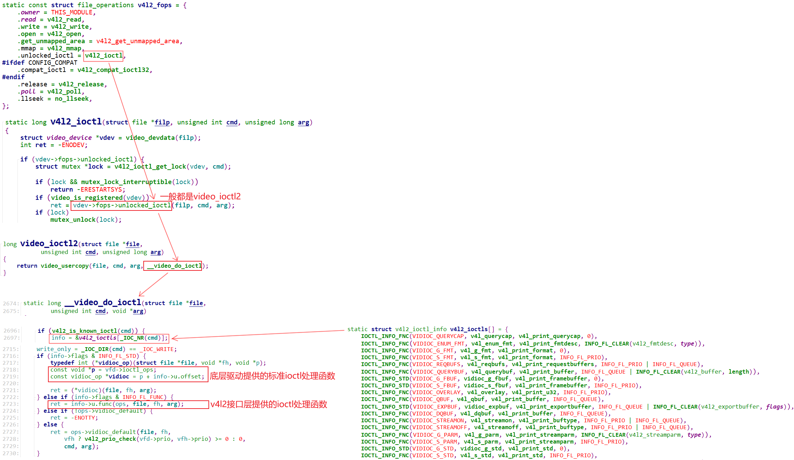

# v4l2驱动框架
参考资料：

* 深入理解linux内核v4l2框架之videobuf2：https://blog.csdn.net/yyjsword/article/details/9243717
* V4L2框架-videobuf2：https://blog.csdn.net/u013904227/article/details/81054611

## 1. 整体框架

* 字符设备驱动程序的核心是：file_operations结构体
* V4L2设备驱动程序的核心是：video_device结构体，它里面有2大成员
  * v4l2_file_operations结构体：实现具体的open/read/write/ioctl/mmap操作
  * v4l2_ioctl_ops结构体：v4l2_file_operations结构体一般使用video_ioctl2函数，它要调用v4l2_ioctl_ops结构体


### 1.1 V4L2驱动程序注册流程
```c
struct video_device
{
	struct device dev;
	struct cdev *cdev;
	struct v4l2_device *v4l2_dev;
	struct v4l2_ctrl_handler *ctrl_handler;

    const struct v4l2_file_operations *fops;
    const struct v4l2_ioctl_ops *ioctl_ops;
    void (*release)(struct video_device *vdev);
};
```

参考 drivers\media\usb\airspy\airspy.c
```c
static struct video_device airspy_template = {
	.name                     = "AirSpy SDR",
	.release                  = video_device_release_empty,
	.fops                     = &airspy_fops,
	.ioctl_ops                = &airspy_ioctl_ops,
};

airspy_probe(struct usb_interface *intf,const struct usb_device_id *id)
    struct airspy *s;
    s = kzalloc(sizeof(struct airspy), GFP_KERNEL);
    // 分配/设置video_device结构体
    s->vdev = airspy_template;

    // 初始化一个v4l2_device结构体(起辅助作用)
    /* Register the v4l2_device structure */
    s->v4l2_dev.release = airspy_video_release;
    ret = v4l2_device_register(&intf->dev, &s->v4l2_dev);

    // video_device和4l2_device建立联系
    s->vdev.v4l2_dev = &s->v4l2_dev;
    // 注册video_device结构体
    ret = video_register_device(&s->vdev, VFL_TYPE_SDR, -1);
            __video_register_device
                // 以次设备号为下标，将video_device放入全局数组后续通过次设备号获取video_device
                for (i = 0; i < VIDEO_NUM_DEVICES; i++)
                    if (video_device[i] == NULL)
                        break;
                vdev->minor = i + minor_offset;
				video_device[vdev->minor] = vdev;
				// 注册字符设备驱动程序 cdev
				vdev->cdev = cdev_alloc();
				vdev->cdev->ops = &v4l2_fops;
				ret = cdev_add(vdev->cdev, MKDEV(VIDEO_MAJOR, vdev->minor), 1);
```

### 1.2 ioctl 调用流程
#### 1.2.1 两类ioctl
底层驱动程序提供了很多ioctl的处理函数，比如：


这些ioctl被分为2类：

* INFO_FL_STD：标准的，无需特殊的代码来处理，APP的调用可以直达这些处理函数
* INFO_FL_FUNC：这类ioctl需要特殊处理，比如对于`VIDIOC_ENUM_FMT`，它需要根据设备的类型分别枚举：


简单地说，这2类ioctl的差别在于：

* INFO_FL_STD：APP发出的ioctl直接调用底层的video_device->ioctl_ops->xxxx(....)
* INFO_FL_FUNC：APP发出的ioctl，交给`drivers\media\v4l2-core\v4l2-ioctl.c`，它先进行一些特殊处理后，再调用底层的video_device->ioctl_ops->xxxx(....)


怎么区分这些ioctl呢？`drivers\media\v4l2-core\v4l2-ioctl.c`中有个数组：


这个数组里，每一项都表示一个ioctl：

* 使用`IOCTL_INFO_FNC`定义的数组项，表示它是`INFO_FL_FUNC`类型的

* 使用`IOCTL_INFO_STD`定义的数组项，表示它是`INFO_FL_STD`类型的


#### 1.2.2 调用流程
APP调用摄像头的ioctl，流程为：


### 1.3 buffer的内部实现