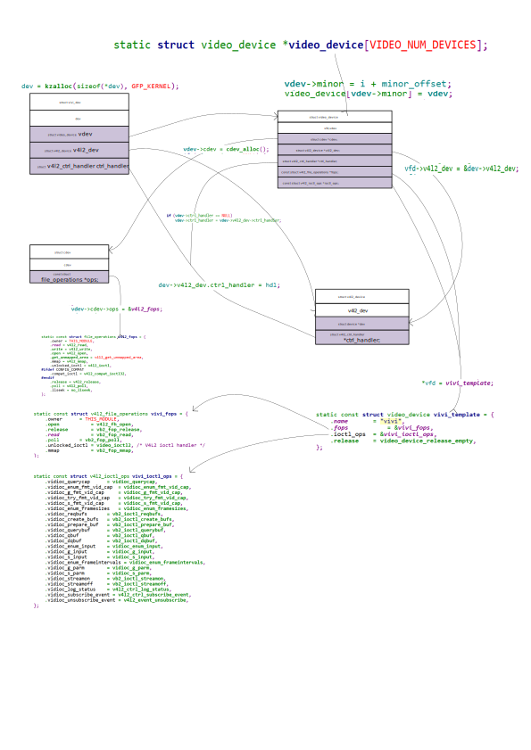

## vivi驱动的创建过程
所有的操作都是围绕着`struct video_device`这个数据结构
```c
// video_device 数据结构
struct vivi_dev {
	struct list_head           vivi_devlist;
	struct v4l2_device 	   v4l2_dev;
	struct v4l2_ctrl_handler   ctrl_handler;
	struct video_device	   vdev;

	/* controls */
	struct v4l2_ctrl	   *brightness;
	struct v4l2_ctrl	   *contrast;
	struct v4l2_ctrl	   *saturation;
	struct v4l2_ctrl	   *hue;
	struct {
		/* autogain/gain cluster */
		struct v4l2_ctrl	   *autogain;
		struct v4l2_ctrl	   *gain;
	};
	struct v4l2_ctrl	   *volume;
	struct v4l2_ctrl	   *alpha;
	struct v4l2_ctrl	   *button;
	struct v4l2_ctrl	   *boolean;
	struct v4l2_ctrl	   *int32;
	struct v4l2_ctrl	   *int64;
	struct v4l2_ctrl	   *menu;
	struct v4l2_ctrl	   *string;
	struct v4l2_ctrl	   *bitmask;
	struct v4l2_ctrl	   *int_menu;

	spinlock_t                 slock;
	struct mutex		   mutex;

	struct vivi_dmaqueue       vidq;

	/* Several counters */
	unsigned 		   ms;
	unsigned long              jiffies;
	unsigned		   button_pressed;

	int			   mv_count;	/* Controls bars movement */

	/* Input Number */
	int			   input;

	/* video capture */
	const struct vivi_fmt      *fmt;
	struct v4l2_fract          timeperframe;
	unsigned int               width, height;
	struct vb2_queue	   vb_vidq;
	unsigned int		   field_count;

	u8			   bars[9][3];
	u8			   line[MAX_WIDTH * 8] __attribute__((__aligned__(4)));
	unsigned int		   pixelsize;
	u8			   alpha_component;
	u32			   textfg, textbg;
};

struct video_device
{
#if defined(CONFIG_MEDIA_CONTROLLER)
	struct media_entity entity;
#endif
	/* device ops */
	const struct v4l2_file_operations *fops;

	/* sysfs */
	struct device dev;		/* v4l device */
	struct cdev *cdev;		/* character device */

	struct v4l2_device *v4l2_dev;	/* v4l2_device parent */
	/* Only set parent if that can't be deduced from v4l2_dev */
	struct device *dev_parent;	/* device parent */

	/* Control handler associated with this device node. May be NULL. */
	struct v4l2_ctrl_handler *ctrl_handler;

	/* vb2_queue associated with this device node. May be NULL. */
	struct vb2_queue *queue;

	/* Priority state. If NULL, then v4l2_dev->prio will be used. */
	struct v4l2_prio_state *prio;

	/* device info */
	char name[32];
	int vfl_type;	/* device type */
	int vfl_dir;	/* receiver, transmitter or m2m */
	/* 'minor' is set to -1 if the registration failed */
	int minor;
	u16 num;
	/* use bitops to set/clear/test flags */
	unsigned long flags;
	/* attribute to differentiate multiple indices on one physical device */
	int index;

	/* V4L2 file handles */
	spinlock_t		fh_lock; /* Lock for all v4l2_fhs */
	struct list_head	fh_list; /* List of struct v4l2_fh */

	int debug;			/* Activates debug level*/

	/* Video standard vars */
	v4l2_std_id tvnorms;		/* Supported tv norms */

	/* callbacks */
	void (*release)(struct video_device *vdev);

	/* ioctl callbacks */
	const struct v4l2_ioctl_ops *ioctl_ops;
	DECLARE_BITMAP(valid_ioctls, BASE_VIDIOC_PRIVATE);

	/* serialization lock */
	DECLARE_BITMAP(disable_locking, BASE_VIDIOC_PRIVATE);
	struct mutex *lock;
};


struct v4l2_device {
	/* dev->driver_data points to this struct.
	   Note: dev might be NULL if there is no parent device
	   as is the case with e.g. ISA devices. */
	struct device *dev;
#if defined(CONFIG_MEDIA_CONTROLLER)
	struct media_device *mdev;
#endif
	/* used to keep track of the registered subdevs */
	struct list_head subdevs;
	/* lock this struct; can be used by the driver as well if this
	   struct is embedded into a larger struct. */
	spinlock_t lock;
	/* unique device name, by default the driver name + bus ID */
	char name[V4L2_DEVICE_NAME_SIZE];
	/* notify callback called by some sub-devices. */
	void (*notify)(struct v4l2_subdev *sd,
			unsigned int notification, void *arg);
	/* The control handler. May be NULL. */
	struct v4l2_ctrl_handler *ctrl_handler;
	/* Device's priority state */
	struct v4l2_prio_state prio;
	/* BKL replacement mutex. Temporary solution only. */
	struct mutex ioctl_lock;
	/* Keep track of the references to this struct. */
	struct kref ref;
	/* Release function that is called when the ref count goes to 0. */
	void (*release)(struct v4l2_device *v4l2_dev);
};

static const struct video_device vivi_template = {
	.name		= "vivi",
	.fops           = &vivi_fops,
	.ioctl_ops 	= &vivi_ioctl_ops,
	.release	= video_device_release_empty,
};

// 通过 file_operation间接调用
static const struct v4l2_file_operations vivi_fops = {
	.owner		= THIS_MODULE,
	.open           = v4l2_fh_open,
	.release        = vb2_fop_release,
	.read           = vb2_fop_read,
	.poll		= vb2_fop_poll,
	.unlocked_ioctl = video_ioctl2, /* V4L2 ioctl handler */
	.mmap           = vb2_fop_mmap,
};
```

虚拟视频驱动vivi.c分析  linux 3.14
1. 分配video_device  vdev
2. 设置 video_device
3. 注册 video_register_device

分析vivi的注册过程





```c
vivi_init
	vivi_create_instance
		// 分配vdev
		dev = kzalloc(sizeof(*dev), GFP_KERNEL) struct vivi_dev  
		v4l2_device_register() （初始化 v4l2_device, 自旋锁，引用计数）
		
		vfd = &dev->vdev;
		*vfd = vivi_template;
		// 设置
		1. vfd
			.fops           = &vivi_fops,
			.ioctl_ops 	= &vivi_ioctl_ops,
			.release	= video_device_release_empty,
		2. v4l2_dev
			vfd->v4l2_dev = &dev->v4l2_dev;
		3. 设置"ctrl属性"(用于APP的ioctl)：
			hdl = &dev->ctrl_handler;
			v4l2_ctrl_handler_init(hdl, 11);
			dev->volume = v4l2_ctrl_new_std(hdl, &vivi_ctrl_ops,
					V4L2_CID_AUDIO_VOLUME, 0, 255, 1, 200);
			dev->brightness = v4l2_ctrl_new_std(hdl, &vivi_ctrl_ops,
					V4L2_CID_BRIGHTNESS, 0, 255, 1, 127);
			dev->contrast = v4l2_ctrl_new_std(hdl, &vivi_ctrl_ops,
					V4L2_CID_CONTRAST, 0, 255, 1, 16);   		   
			dev->v4l2_dev.ctrl_handler = hdl;

		// 注册
		video_register_device(vdev, type: VFL_TYPE_GRABBER, num: nr);
			__video_register_device(vdev, type, nr, 1, vdev->fops->owner)
				// part1：检查类型 part2：找到可用的次设备号 
				if (vdev->ctrl_handler == NULL)
					vdev->ctrl_handler = vdev->v4l2_dev->ctrl_handler;
				for (i = 0; i < VIDEO_NUM_DEVICES; i++)
					if (video_device[i] == NULL)
						break;
				vdev->minor = i + minor_offset;
				// 以次设备号为下标，将video_device存下来
				video_device[vdev->minor] = vdev;
				// part3：初始化cdev
				vdev->cdev = cdev_alloc();
				vdev->cdev->ops = &v4l2_fops;
				ret = cdev_add(vdev->cdev, MKDEV(VIDEO_MAJOR, vdev->minor), 1);

				// part4：在sysfs中注册设备
				ret = device_register(&vdev->dev);
```

## vivi驱动的 open, read, ioctl 调用过程
1. open
```c
app: open("/dev/videox", O_RDWR);

drv:
	v4l2_fops.open = v4l2_open(struct inode *inode, struct file *filp)
		vdev = video_devdata(filp); // 根据次设备号从video_device数组中得到video_device
		vdev->fops->open(filp);
			struct v4l2_file_operations .open  = v4l2_fh_open,
```
2. read
```c
app: open(...);

drv:
	v4l2_fops.read = v4l2_read(struct file *filp, char __user *buf, size_t sz, loff_t *off)
		vdev = video_devdata(filp);
		vdev->fops->read(filp);
			struct v4l2_file_operations .read = vb2_fop_read
```
3. ioctl
```c
app: ioctl(...)

drv:
	v4l2_fops.unlocked_ioctl = v4l2_ioctl(struct file *filp, unsigned int cmd, unsigned long arg)
		struct video_device *vdev = video_devdata(filp);
		ret = vdev->fops->unlocked_ioctl(filp, cmd, arg);
			video_usercopy(file, cmd, arg, __video_do_ioctl);
				__video_do_ioctl
					struct video_device *vfd = video_devdata(file);
					根据APP传入的cmd来获得、设置"某些属性"
```

v4l2_ctrl_handler的使用过程:
```c 
    __video_do_ioctl
        struct video_device *vfd = video_devdata(file);

    	case VIDIOC_QUERYCTRL:
    		struct v4l2_queryctrl *p = arg;
    
    		if (vfh && vfh->ctrl_handler)
    			ret = v4l2_queryctrl(vfh->ctrl_handler, p);
    		else if (vfd->ctrl_handler)  // 在哪设置？在video_register_device
    			ret = v4l2_queryctrl(vfd->ctrl_handler, p);
    			            // 根据ID在ctrl_handler里找到v4l2_ctrl，返回它的值
```